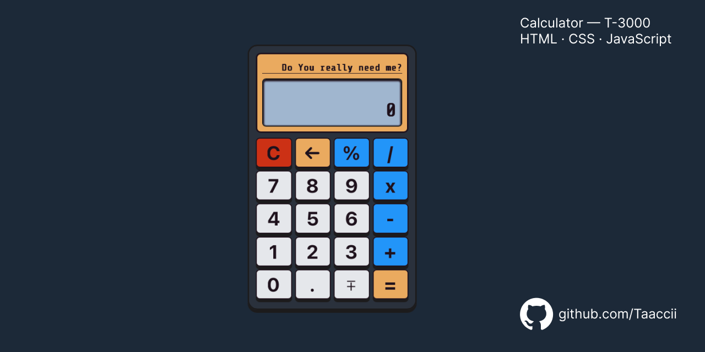

# T-3000 Calculator

> A fully functional calculator built with vanilla JavaScript, HTML and CSS.

---

## 🔗 Live Demo

**Live Demo:** [taaccii.github.io/calculator-project](https://taaccii.github.io/calculator-project/)

---

## ✨ Features

- **Basic operations** — addition, subtraction, multiplication, division
- **Chained operations** — evaluates expressions sequentially (e.g. `12 + 7 - 1 =`)
- **Percentage** — calculates relative to the first number (e.g. `300 - 10% = 270`)
- **Sign toggle**, **decimal support**, **backspace** and **clear**
- **Repeat on `=`** — pressing `=` multiple times repeats the last operation
- **Keyboard support** — full keyboard input (`0-9`, `+`, `-`, `*`, `/`, `Enter`, `Backspace`, `Escape`, `.`, `%`)
- **Dual display** — upper display shows the current operation, main display shows the result
- **Error handling** — friendly message on division by zero with a visual red flash
- **Responsive** — works on desktop, tablet, and mobile

---

## 🛠️ Tech Stack

| Component | Technology |
|-----------|------------|
| **Markup** | HTML5 |
| **Style** | CSS3 |
| **Logic** | JavaScript ES6+ |
| **Font** | Google Fonts — Share Tech Mono |

---

## 💡 What I Learned

- Managing calculator state with variables and boolean flags (`calculated`, `isPercent`)
- Handling edge cases (division by zero, double decimal, leading zeros, chained operations)
- Mapping keyboard events to existing DOM elements via `button.click()`
- Building a responsive layout with `vw` units and media queries

---

## 📝 Notes

This was one of the most enjoyable projects of the curriculum so far. Building the calculator logic step by step helped me consolidate a lot of JavaScript fundamentals — state management, event handling, edge cases — things that are hard to grasp in theory but click immediately when you build something real.

---

## 📄 License

This project is licensed under the **MIT License** — see [`LICENSE`](./LICENSE) for details.

---

## 👨‍💻 Author

**TacciDev**

- 📧 [taccidev@gmail.com](mailto:taccidev@gmail.com)
- 🐙 GitHub: [@Taaccii](https://github.com/Taaccii)
- 💼 LinkedIn: [alessandro-barletta-dev](https://linkedin.com/in/alessandro-barletta-dev)

---

> *Project built as part of [The Odin Project](https://www.theodinproject.com/lessons/foundations-calculator) Foundations curriculum.*